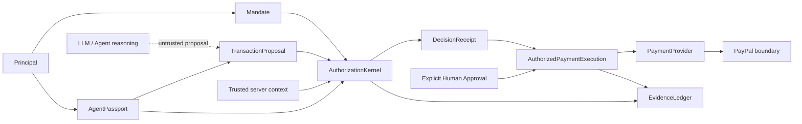

# PayFlow Trust Kernel Architecture

## Security boundary

PayFlow treats an AI agent as an untrusted proposer, not a financial authority. The agent may discover, reason and propose. It cannot determine that its own proposal is authorized.

The LLM is outside the trusted boundary because probabilistic model output is not an authorization primitive. Security policy is explicit, typed and deterministic.

## Domain flow

`Principal → Mandate → AgentPassport → TransactionProposal → AuthorizationKernel → DecisionReceipt → AuthorizedPaymentExecution → PaymentProvider → EvidenceLedger`

A principal authors authority. A mandate binds scope, budget, category, conditions, risk ceiling, capabilities, expiry and replay material. An AgentPassport identifies the delegate and its independent capability ceiling. A proposal asks for an action but contains no trusted authorization decision. Server context supplies merchant risk, cumulative spend and replay state. The kernel produces a receipt with stable reason codes and check outcomes.

The in-process service records every issued Decision Receipt together with the exact evaluated mandate and proposal. The normal execution path rejects receipts that were not issued by that service instance and rejects proposal substitution after authorization. This is deliberately an in-process Milestone 1 boundary, not a claim of distributed cryptographic authorization.

## Architectural decisions

### ADR-001 — Hash, do not claim signature

`mandateFingerprint` is SHA-256 over canonical security-critical mandate fields. It detects substitution against the fingerprint supplied with the original proposal. It is not an asymmetric signature and does not prove who authored a mandate.

### ADR-002 — Capabilities intersect

A capability must exist in both the mandate and AgentPassport. Capabilities do not imply one another.

### ADR-003 — Fail closed

Schema failures and contradictory threshold configuration deny authorization. Unknown critical state never becomes `ALLOW`.

### ADR-004 — Escalation preserves history

`ESCALATE` remains the original authorization result. Human approval is a separate object and evidence event; the mandate and Decision Receipt are not rewritten. Approval is accepted only for a kernel-issued escalation and must name the mandate principal. Authentication of the human/session supplying that identity remains future work.

### ADR-005 — Payment dependency inversion

Application code targets `PaymentProvider`; `MockPaymentProvider` proves orchestration without money movement. `PayPalPaymentProvider` deliberately throws in Milestone 1 rather than pretending a network integration exists.

### ADR-006 — Tamper evidence, not immutable storage

Evidence entries form a SHA-256 hash chain including sequence and previous hash. Verification detects modification/reordering. In-memory storage can still be deleted or replaced wholesale, so this is not immutable storage or a blockchain.

### ADR-007 — In-process authorization artifact

The normal payment path requires an opaque symbol-branded authorization artifact minted by `AuthorizedPaymentExecutor`, and the service will only request that artifact for a Decision Receipt it previously issued. This is a useful module boundary, not a cross-process security credential. Milestone 2 should replace/augment it with short-lived signed grants and transactional persistence.

### ADR-008 — Replay state is fail-closed but process-local

A mandate-scoped proposal nonce or proposal ID that has already been evaluated is treated as replay and denied, including retries of previously denied proposals. Durable atomic uniqueness is intentionally deferred.

## TOCTOU and state

Cumulative spend, replay state, issued receipts and approvals are in-memory in Milestone 1. This proves semantics but is not concurrency-safe across processes. Production execution requires an atomic reservation/commit transaction so authorization state cannot change between evaluation and payment side effect.
