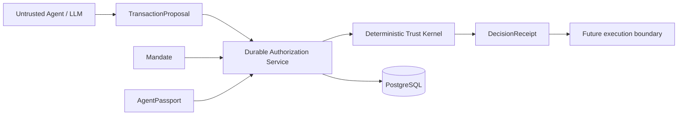

# PayFlow Architecture — Milestone 2B

## Boundary



The deterministic Trust Kernel remains independent of PostgreSQL. The LLM/agent is an untrusted proposer and cannot authorize financial authority. `DurableAuthorizationService` is the production orchestration boundary for Milestone 2B.

## ADR-013 — Per-mandate serialization point

An authorization transaction first loads the proposal, then locks the authoritative mandate row with `SELECT ... FOR UPDATE`. Every path that can acquire or change financial authority for that mandate uses the same mandate-row serialization point before calculating capacity or creating a reservation.

PostgreSQL's default `READ COMMITTED` isolation is used. The guarantee is deliberately narrower than serializable isolation: competing authority changes for one mandate serialize on that mandate row. PayFlow does not claim global serializability or distributed multi-database guarantees.

Within the transaction PayFlow loads and runtime-validates the mandate, agent and proposal, derives current accounting from reservation rows, reruns the deterministic Trust Kernel, persists the Decision Receipt and evidence, and—only for an eligible ALLOW—claims replay identifiers and creates the reservation before commit. A rollback removes the receipt, replay claims, reservation and evidence written by that transaction.

## ADR-014 — Derived cumulative authority

`mandates.spent_minor` is not authoritative in 2B. Capacity is derived from durable reservation rows:

```text
committed = SUM(amount) WHERE status = COMMITTED
active_reserved = SUM(amount) WHERE status IN (AUTHORIZED, EXECUTING)
consumed = committed + active_reserved
available = cumulative_limit - consumed
```

`RELEASED`, `EXPIRED`, `FAILED` and `PENDING` do not consume executable authority. Money remains integer minor units. Because calculation and reservation creation occur while holding the mandate lock, concurrent proposals cannot both observe the same unreserved capacity and acquire it.

## ADR-015 — Escalation approval

An ESCALATE receipt remains unchanged. Approval is a separate durable record bound to receipt, proposal and principal. Approval takes the mandate lock, reloads and validates persisted state, recomputes accounting, reruns policy for current eligibility, claims replay identifiers, then creates an `AUTHORIZED` reservation in the same transaction. No production human-identity authentication claim is made; the service only enforces principal-ID binding supplied by its caller.

## ADR-016 — Reservation accounting and recovery

The success lifecycle remains `AUTHORIZED → EXECUTING → COMMITTED`. `AUTHORIZED` and `EXECUTING` consume reserved authority. `COMMITTED` consumes committed authority. `RELEASED`, `EXPIRED` and `FAILED` restore capacity. Illegal transitions fail closed.

Stale `PENDING`/`AUTHORIZED` reservations can be expired deterministically. Expiry is durable and idempotent, never releases `COMMITTED` rows, and writes evidence in the same transaction. A background scheduler is not part of 2B.

## ADR-017 — Durable replay and evidence

Proposal IDs are globally unique and proposal nonces are mandate-scoped unique at persistence. Executable ALLOW/approved-ESCALATE paths also claim both proposal ID and nonce in durable replay storage inside the authority transaction. Concurrent duplicates cannot both acquire authority.

Evidence writes participate in the same database transaction as authorization state. A rolled-back authorization therefore cannot leave a durable success event. The SHA-256 previous-hash chain remains tamper-evident, not immutable; a privileged database writer can rewrite/re-hash/delete the chain.

## Remaining execution TOCTOU boundary

Milestone 2B ends at durable authorization/reservation eligibility. It does not yet cryptographically bind a later payment execution to the exact authorized proposal/reservation, and it does not implement immediate pre-provider execution revalidation. Those controls are deferred to the cryptographic execution-grant milestone. PayPal, LLM functionality, product discovery and UI are not implemented here.
