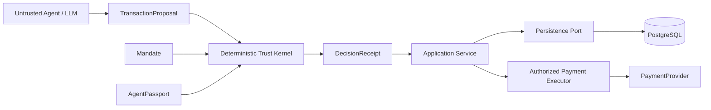

# PayFlow Architecture — Milestone 2A

## Boundary

The kernel remains a pure deterministic domain component. PostgreSQL is behind a persistence boundary and does not decide policy. The LLM is an untrusted proposer and cannot mint authorization.

## ADR-009 — PostgreSQL durability

Security-critical durable records use PostgreSQL. The initial migration models principals, passports, mandates, proposals, receipts, approvals, replay keys, reservations, payment attempts and evidence. Monetary columns are integer minor units (`bigint`) with checks.

## ADR-010 — Durable replay uniqueness

Proposal IDs are globally unique. Proposal nonces are unique within a mandate. General replay claims use an atomic `(scope,replay_key)` primary key and `INSERT ... ON CONFLICT DO NOTHING`, allowing callers to fail closed on duplicates.

## ADR-011 — Reservation state foundation

Reservation transitions are explicit and validated in application code while the target row is locked `FOR UPDATE`. This prevents two writers from independently transitioning the same reservation from the same state. Milestone 2A does not yet perform authorization plus cumulative-budget reservation in one transaction, so it does not claim concurrency-safe spending authority.

## ADR-012 — Durable tamper-evident evidence

Evidence persists in PostgreSQL. A transaction-scoped advisory lock serializes chain append, and each event hashes its sequence, ID, type, timestamp, payload and previous hash. Verification detects modification/reordering. A privileged database writer can rewrite/re-hash or delete the ledger, so this is not immutable storage.

## Deferred

2B must introduce an atomic authorization/reservation transaction and authoritative cumulative accounting. Cryptographic execution grants and PayPal Sandbox are intentionally not implemented in 2A.
